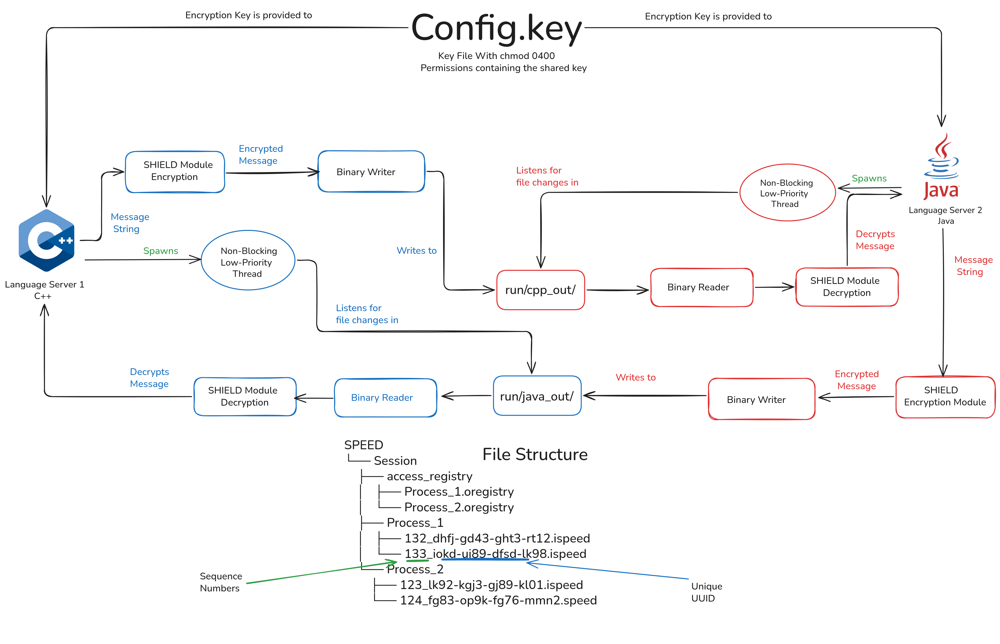
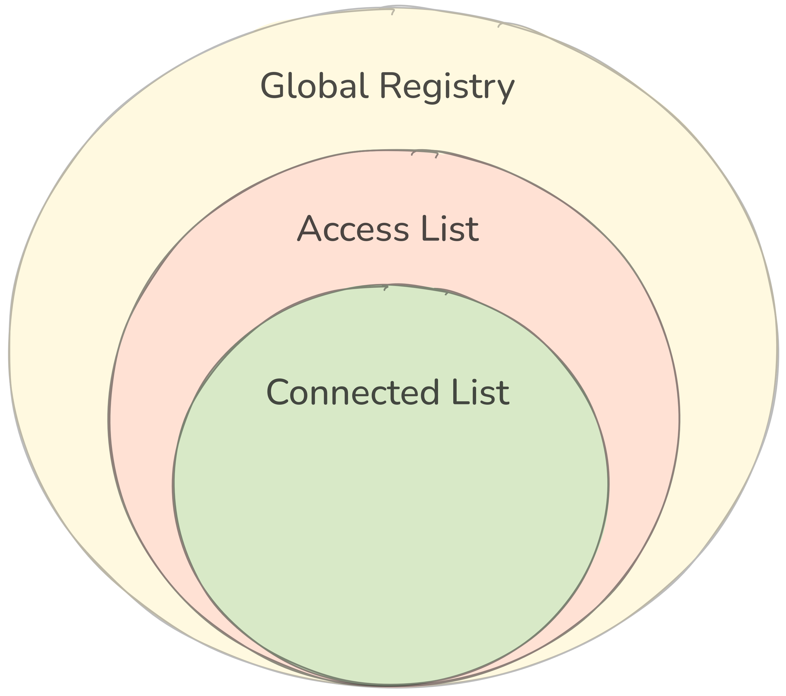

# SPEED IPC Protocol Documentation

This document outlines the key flows in the IPC (Inter-Process Communication) protocol, including process startup, message sending, and message receiving. The descriptions assume specific example processes (e.g., `P1`, `P2`) for illustration purposes.

## Process Arrival/Startup Flow (First Time)

This section describes the initial startup sequence for a process, using `P1` as an example.

### Step 1
In the initial step, a dedicated folder for the current process is created to facilitate communication. For process `P1`, this involves creating a folder named `P1` within the specified `SPEED` directory. If a folder with the same name already exists, it is deleted, and a new one is created.

### Step 2
After creating the process folder in Step 1, the global registry is constructed. This requires traversing the entire `access_registry` folder, identifying files that strictly end with `.oregistry`, and adding them to the `global_registry_`.

### Step 3
The current process `P1` then registers its access file in the `access_registry`. It creates an intermediate file named `P1.iregistry` and writes the process name `P1` to it. Once writing is complete, the file is renamed to `P1.oregistry` to indicate that it is ready for processing.

### Step 4
In this step, `P1` compares its `access_list_` with the `global_registry_` to verify whether the process names listed in `access_list_` are available for connection in the `global_registry_`.

### Step 5
Connection requests are now sent to processes that appear in both the `access_list_` and the `global_registry_`. Process `P1` places a connection request message of type `CON_REQ` in the respective folders of all qualifying processes.

### Step 6
After sending the connection requests, `P1` awaits `CON_ACPT` responses. For example, if `P1` sends a `CON_REQ` to `P2`, `P2` checks whether `P1` is in its `access_list_`. If so, `P2` responds with a `CON_ACPT`.

### Step 7
Following the dispatch of connection requests, `P1` waits for 500ms to collect all `CON_ACPT` responses. As these are received, the corresponding processes are added to `P1`'s `connected_list_`, signifying successful connections.

### Step 8 (Final)
With connections established, communication can commence.

## Process Message Sending Flow

This section details the flow for sending messages from one process to others, using `P1` sending to `P2`, `P3`, and `P4` as an example.

### Step 1
The user or developer invokes the function:

```cpp
speed.sendMessage("Hello", ["P2", "P3"]);
```

This instructs SPEED to transmit the message `"Hello"` to both `P2` and `P3`.

### Step 2
The system first validates the availability and accessibility of `P2` and `P3`. SPEED checks the `global_registry_` to confirm whether `P2` and `P3` are present. If found, proceed; otherwise, continue to Step 3.

### Step 3
Suppose `P2` is in the `global_registry_`, but `P3` is not. This likely indicates that `P3`'s arrival was not detected by `P1`, rendering `P1`'s `global_registry_` snapshot outdated. `P1` re-traverses the `access_registry` folder to incrementally update its `global_registry_`. Assume `P3` is now found.

### Step 4
With `P3` available but not yet connected, `P1` sends a `CON_REQ` to `P3`. Assuming `P3` accepts and responds with `CON_ACPT`, the connection is established. `P1` adds `P3` to its `connected_list_`, and vice versa.

### Step 5 (Final)
At this point, both `P2` and `P3` are ready for messaging. `P1` sends the `"Hello"` message to both, which they receive and process.

## Process Message Receiving Flow

This section describes the flow for receiving messages, using `P2` and `P3` sending `"Hello"` and `"Welcome"` to `P1` as an example, assuming `P1` is available.

### Step 1
Both `P2` and `P3` encrypt and write their message binary files into `P1`'s process folder.

### Step 2
`P1` detects these files. For illustration:
- `P2` writes `"Hello"` to `0021_fghg-43fd-34ff-234t.ospeed`.
- `P3` writes `"Welcome"` to `0023_3ehg-klfd-90ff-jk87.ospeed`.

### Step 3
`P1` focuses on the sequence numbers, extracting them and storing in a sorted mapping (key: sequence number, value: full filename) to maintain FIFO order:

```
    key     value
    21  :  0021_fghg-43fd-34ff-234t.ospeed
    23  :  0023_3ehg-klfd-90ff-jk87.ospeed
```

`P1` processes the file with the lowest sequence number first.

### Step 4
`P1` reads the binary file `0021_fghg-43fd-34ff-234t.ospeed` and passes it to the binary manager.

### Step 5
Using known offsets, `P1` jumps to the `reciever_name` field, decrypts it, and verifies if it matches `P1`'s name to confirm the message is intended for it. If not, the file is deleted; otherwise, proceed.

### Step 6
Assuming the message is for `P1`, it next checks if the sender (`P2`) is in its `access_list_` to ensure permission. If found, `P1` decrypts and processes the full message.

### Step 7 (Final)
`P1` similarly processes the message from `P3` in file `0023_3ehg-klfd-90ff-jk87.ospeed` with sequence number `23`.

## Architecture Diagram
.png)

## Flow Diagram


## Data Structures: Overview and Working
This section explains how the three core data structures in the access control system interact and work together.
For better understanding, the following abbreviations will be used throughout:
- **Global Registry: GR**
- **Access List / Allowed List: AL**
- **Connected List: CL**

### Global Registry (GR)
The Global Registry acts as a synchronized in-memory representation (or snapshot) of the ``access_registry`` folder.
While the access_registry exists physically as a folder, the Global Registry is its programmatic equivalent - both represent the same logical structure.

Each process maintains its own **GR**, which stores the list of all currently active processes within a session. This allows every process to be aware of other potential peers it could communicate with in the future.

Whenever a process joins or leaves the session, all existing processes automatically update their GRs to remain in sync with the ``access_registry``.

In essence, the **GR** provides a live view of the session’s process ecosystem.

### Access List (AL)
The **Access List** (AL), also known as the **Allowed List**, sits one level below the Global Registry.
It represents the subset of processes that the current process is allowed to communicate with - defined explicitly by the developer.

Unlike the **GR**, which lists all available processes, the **AL** only contains those that have been granted permission for communication. It does not indicate active connections, only potential ones which could become active connections in future.

The **AL** is defined by the developer, like a developer can use the API function to add a process for communication.

For example:
```cpp
ipc.addProcess("proc_2");
ipc.addProcess("proc_3");
```
Here, the process declares that it is open to communicating with ``proc_2`` and ``proc_3`` whenever they initiate a connection.

If a process listed in the **AL** sends a **CON_REQ** (connection request), it can be safely accepted since prior permission exists.
### Connected List (CL)
The **Connected List (CL)** represents the lowest layer of the hierarchy - it contains the processes that are currently connected and actively exchanging messages.

In other words, a process appears in the CL only after a successful handshake sequence:
- You send a ``CON_REQ``,
- The peer accepts with a ``CON_ACPT``,
- And both establish a communication channel.

Thus, the **CL** provides the real-time state of all active peer connections within the system.


## Relationships Between GR, AL, and CL

The relationship among the three lists is hierarchical but not strictly inclusive:

- Every **Connected List (CL)** entry must exist in the **Access List (AL)** (you can only connect to allowed processes).

- Every **Access List (AL)** entry must exist in the **Global Registry (GR)** (you can only allow processes that actually exist).
- However:
    - Not every **GR** process is in the **AL** (you may not allow all processes).
    - Not every **AL** process is in the **CL** (you may not be connected to all allowed ones).

In short:
```
All CL ⊆ AL ⊆ GR
but
GR ≠ AL ≠ CL
```

### An Analogy
To visualize the relationship between these three lists:

- **Global Registry (GR)**: Like your entire contact list of 10 friends.
You know they exist and can potentially reach them.

- **Access List (AL)**: Out of those 10, you have 4 friends’ numbers saved - you can call them if you choose.

- **Connected List (CL)**: From those 4, you are currently on a group call with 2 - representing live communication channels. And in future you can also add the other 2 to the group call.

### Visual Diagram Description

